# See2Teach User Documentation
**See2Teach** is web application for supporting the peer review of teaching in the University of Auckland. 
The overall goal of this project is to create a refined peer review system that teachers can utilise to improve their teaching.

 This document will guide you to understand the use process of the application and help you skillfully use the functions.
## 1. Dashboard
Dashboard is the main page of the webpage. The diagram shows the summary of my reviews by categorize the reviews.
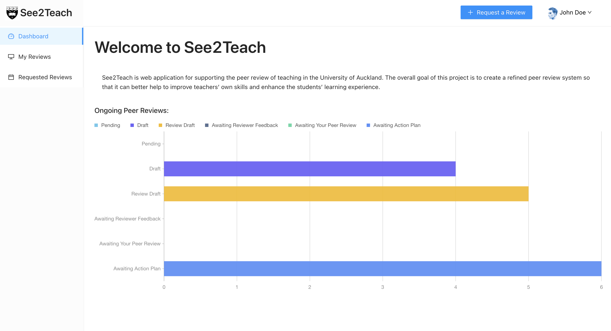

## 2. Check peer review
### My Reviews Page
My reviews page contains all the requested peer reviews by the user. The user can check the status and view the detail of each peer review.
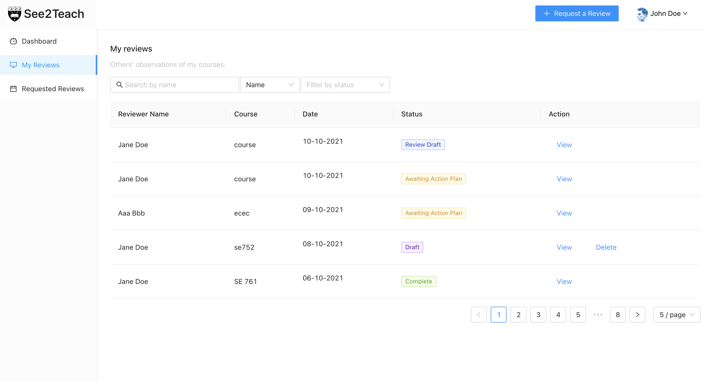

### Requested Reviews Page
Requested reviews page contains all the peer review requests from other users. The user can view the detail of each peer review request and give review comments.
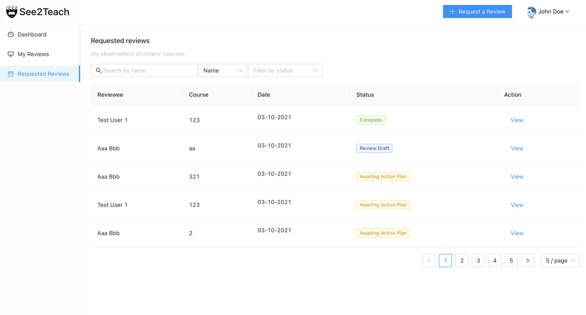

## 3. Create a peer review request
### Step 1
To create a peer review request, clicking the 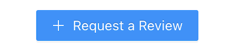 button at the top of the page.
### Step 2
Fill the required information.
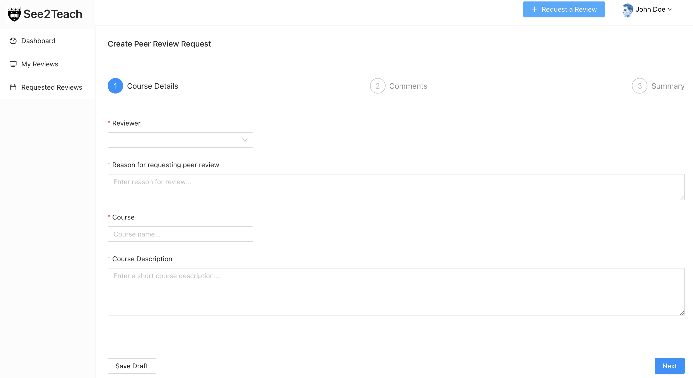

### Step 3
Select the teaching aspects you want to review and add comments.
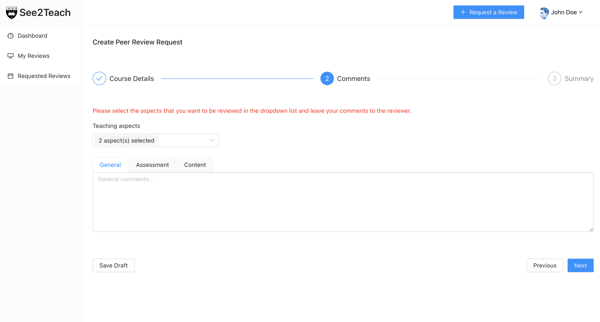

### Step 4
Check the detail and submit.
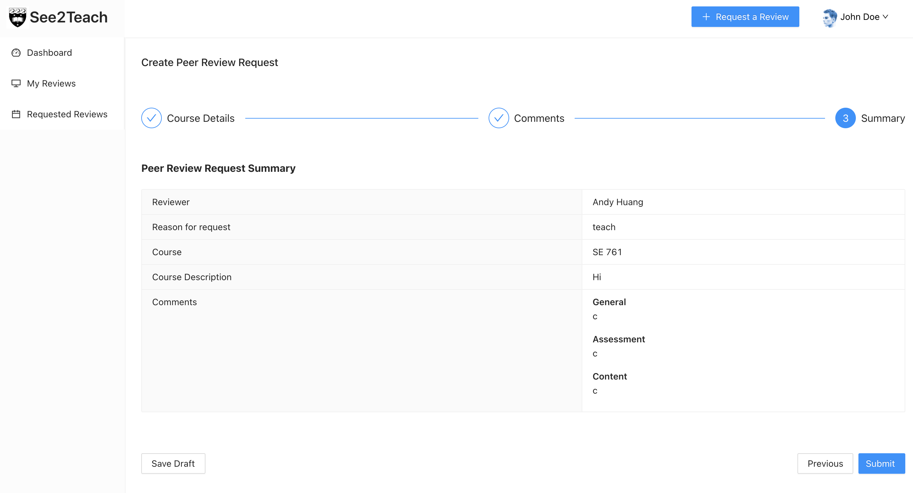

## 4. Doing peer review
### Step 1
Click the "view" button of peer review in Requested reviews page
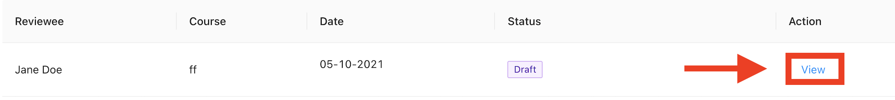
### Step 2
Accept the request and start reviewing
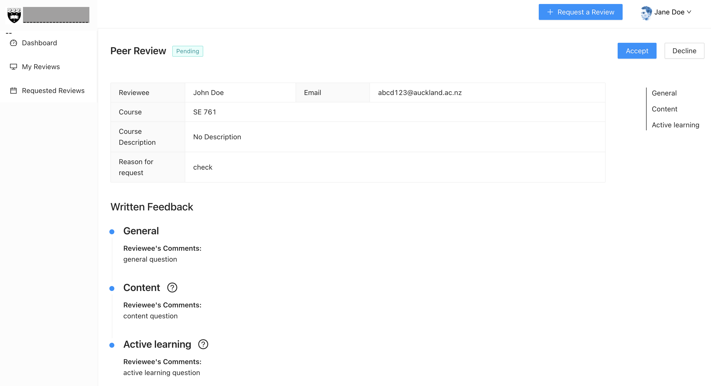

### Step 3
Submit the peer review
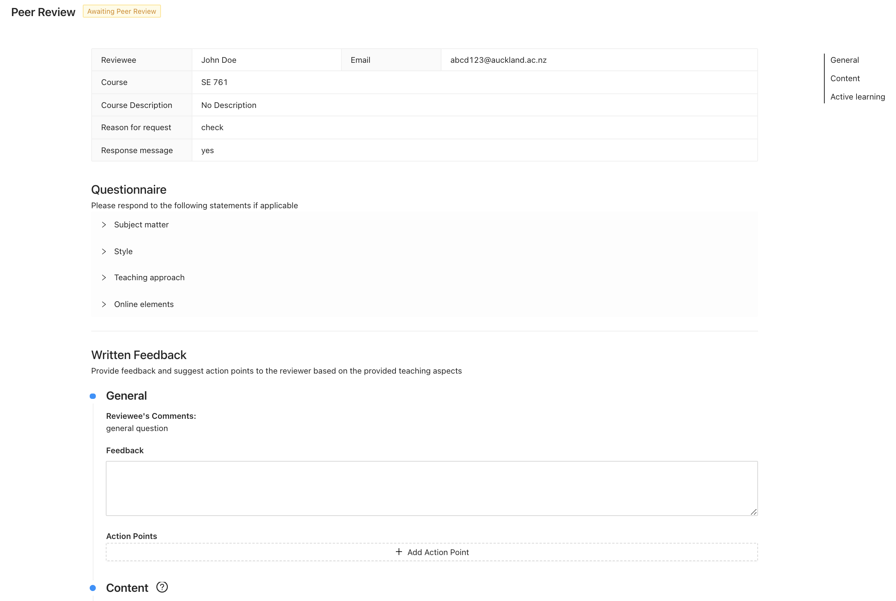

## 5. Submit Action Plam
Reviewee is allowed to submit action plan of the review after the reviwer finishing the review questions. Reviewee need to click the "Submit Action Plan" on the top right, and submit their action plan.
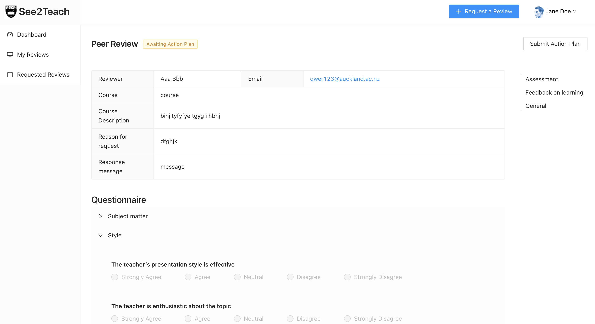
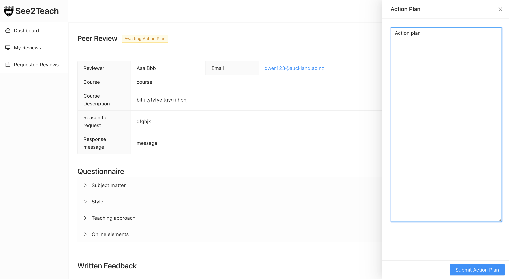
> Congratulations! 
